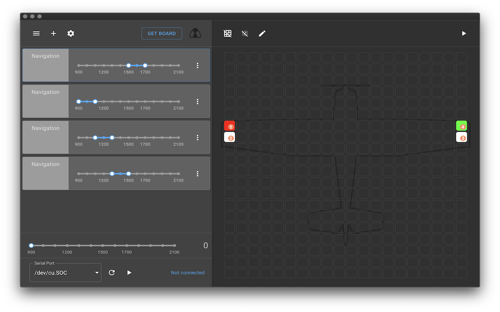

<h1 align="center">
	
	 
	BitsyLED 
</h1>

	A minimal firmware and configurator to drive RGB LED's

---

# Introduction

BitsyLED is a minimal firmware to drive RGB LED's (WS2811, WS2812, NeoPixels, etc). It's designed for anything RC but also can be used for other projects including Christmas lights, Lego's, or even your real car.

BitsyLED is divided into two parts: The Firmware and the Configurator. The firmware can be run on most Arduino compatible boards and I also created a dedicated board (see below) that is targetted primarily for RC purposes.

The Configurator is designed for Chrome however I learned too late that Google has dropped support for Chrome Apps. You can still install the Configurator as unpacked extension and use it that way.

## Features

By default the firmware is set to the following settings which is the maximum amount supported by the ATTINY. The firmware can be reconfigured through the file `config.h`.

* Up to 5 individual ranges, selectable through either an RC PWM signal, Analog signal, Time (Coming soon) or always on.

* 3 LED data strands per range (Left, Right, Other)

* Each data strand can have up to 10 LED's

* Supports multiple patterns such as Off, Solid, Blink, Strobe and Pulse. 

* Supports different speeds per pattern

* Simulate your patterns directly through the BitsyLED configurator

## Status

The configurator and firmware are still under development but some parts may change as I have time to complete the following objectives:

- Move Configurator to Electron (In Progress)
- Introduce curves for custom light patterns (Pending)
- Add presets (Pending)
- Add serial debug output (In Progress)
- More documentation

## Firmware

The firmware is designed for Arduino compatible boards. I also created a dedicated board called the BitsyLED board.

The default firmware configuration is setup for the BitsyLED board which sports a 16bit ATTINY84 that supports up to 5 selectable configurations. Each configuration can have 3 data strands with up to 10 LED's per strand. 

The firmware can be reconfigured as needed.

## Configurator

The configurator is a visual tool that allows easy setup of LED's and supports various effects such blinking, strobe and pulsing.

It allows to setup different selectable ranges which can be controlled via an PWM RC signal, a 10k Analog Potentiometer or based on Time (TBD).

The configurator is available currently only as unpacked Chrome extension that needs to be installed manually. Check the release tab for the files.

## Hardware

Right now I don't offer a complete build of the board however you can order your own copy on Oshpark:

https://oshpark.com/shared_projects/AeP6Ik4a

# Installation

Follow the installation notes for installing an unpacked Chrome application.

You will find the latest release in the release tab.

## License

This program is free software: you can redistribute it and/or modify
it under the terms of the GNU General Public License as published by
the Free Software Foundation, either version 3 of the License, or
(at your option) any later version.

This program is distributed in the hope that it will be useful,
but WITHOUT ANY WARRANTY; without even the implied warranty of
MERCHANTABILITY or FITNESS FOR A PARTICULAR PURPOSE. See the
GNU General Public License for more details.

You should have received a copy of the GNU General Public License
along with this program. If not, see <http://www.gnu.org/licenses/>
