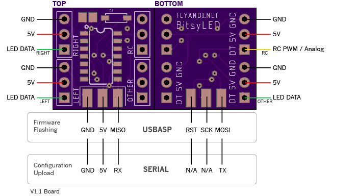

<h1 align="center">
	
	 
	BitsyLED 
</h1>

	A minimal firmware and configurator to drive RGB LED's

---

Click below for a video:

# Introduction

BitsyLED is a minimal firmware to drive RGB LED's (WS2811, WS2812, NeoPixels, etc). It's designed for anything RC but also can be used for other projects including Christmas lights, Lego's, or even your real car.

BitsyLED is divided into two parts: The Firmware and the Configurator. The firmware can be run on most Arduino compatible boards and I also created a dedicated board (see below) that is targeted primarily for RC purposes.

## Features

By default the firmware is set to the following settings which is the maximum amount supported by the ATTINY. The firmware can be reconfigured through the file `config.h`.

* Up to 5 individual ranges, selectable through either an RC PWM signal, Analog signal, Time based or always on.

* 3 LED data strands per range (Left, Right, Other)

* Each data strand can have up to 10 LED's

* Supports multiple patterns such as Off, Solid, Blink, Strobe and Pulse. 

* Supports different speeds per pattern

* Simulate your patterns directly through the BitsyLED configurator

## Status

The configurator and firmware are still under development but some parts may change as I have time to complete the following objectives:

- Introduce curves for custom light patterns (Pending)
- Add presets (Pending)
- Add serial debug output (In Progress)
- More documentation (getting there)
- Upload firmware directly from the configurator (Pending)

## Firmware

The firmware is designed for Arduino compatible boards. I also created a dedicated board called the BitsyLED board.

The default firmware configuration is setup for the BitsyLED board which sports a 8bit ATTINY84 that supports up to 5 selectable configurations. Each configuration can have 3 data strands with up to 10 LED's per strand. 

The firmware can be reconfigured as needed via the `config.h` file. 

### Board Support

| Board | Ranges | Strands/Range | LED's/Strand | Possible Combinations | Config |
| ----  | ------ | ------------- | ------------ | --------------------- | ------- | 
| BitsyLED | 5 | 3 | 10 | 150 | `BOARD_BITSYLED` in `config.h` |
| Arduino | 6 | 3 | 25 | 450 | `BOARD_ARDUINO` in `config.h` |

## Configurator

The configurator is a visual tool that allows easy setup of LED's and supports various effects such blinking, strobe and pulsing.

It allows to setup different selectable ranges which can be controlled via an PWM RC signal, a 10k Analog Potentiometer or based on Time (TBD).

### Installation

The configurator is available as standalone app since Google has dropped support for Chrome Apps. Please download the latest release for your platform from the `releases` tab.

Once installed, the application will automatically updates itself once new versions are released.

## Hardware

Right now I don't offer a complete build of the BitsyLED board however you can order your own copy on Oshpark. 

Alternatively the firmware runs perfectly fine on any Arduino compatible board with the caveat that the firmware and configurator settings are statically aligned to the Arduino Pro Mini with a maximum of 1024bytes of EEPROM.

### v1.1 

https://oshpark.com/shared_projects/E85sUqFS

Parts needed (DigiKey.com):

- 1x ATTINY84 (Part ATTINY84A-SSURCT-ND) 
- 1x Capacitor in 805 packaging (587-1304-1-ND) 
- 1x Diode in SOD-123 packaging (MMSZ5242B-TPMSCT-ND)

#### How to use the board

The board has 3 LED channels: Left, Right and Other; plus an input channel that either can be served by an RC-PWM or Analog signal. Ensure that your configuration selectest the proper input.

Additionally the board has a top and bottom SMD connector that is used as a dual function to upload the firmware and as serial port.

Follow the connection diagram below how to connect 

You will need an USBASP to upload the Firmware and an serial capable board (like FTDI adapter) to upload the configuration from the configurator.

### v1.2

https://oshpark.com/shared_projects/GW6rcqF8

I created a new board that is slimmer and has SMD pad's instead of the drill pad's which gives it more flexibility. The board also comes with an status LED.

I have not received my own copy of this, so stay tuned for more info.

### v2.0

Working on a new board with USB support. Stay tuned.

### Arduino

As described above, the Arduino configuraton is statically aligned for the Arduino Pro Mini series which has by default an EEPROM size of `1024 bytes`.

However that amount of storage still results in up to `6` selectable ranges, each with `3` strands and up to `25` led's per strand.

The following pin map is being used for BitsyLED:

| Pin | Purpose | 
| ----  | ------ |
| 9 | Input for RC PWM or Analog |
| 10 | Left Strand Data Channel |
| 11 | Right Strand Data Channel |
| 12 | Other Strand Data Channel |

Also if enabled, BitsyLED will use the internal LED on pin `13` as status LED.

## Installation

Please download the latest binary from the releases tab or clone this project and build your own version. 

For firmware, you will need the Arduino IDE (easiest). Clone this project and ipen the `bitsyled.ino` in the `firmware` folder. Follow the direction for your board to upload.

For the BitsyLED board you need to install ATTINY board support into your IDE.

## Help and Discussion

For support, help or discussion please visit my official thread on RCGroups: 

https://www.rcgroups.com/forums/showthread.php?3289805-BitsyLED

## License

This program is free software: you can redistribute it and/or modify
it under the terms of the GNU General Public License as published by
the Free Software Foundation, either version 3 of the License, or
(at your option) any later version.

This program is distributed in the hope that it will be useful,
but WITHOUT ANY WARRANTY; without even the implied warranty of
MERCHANTABILITY or FITNESS FOR A PARTICULAR PURPOSE. See the
GNU General Public License for more details.

You should have received a copy of the GNU General Public License
along with this program. If not, see <http://www.gnu.org/licenses/>
